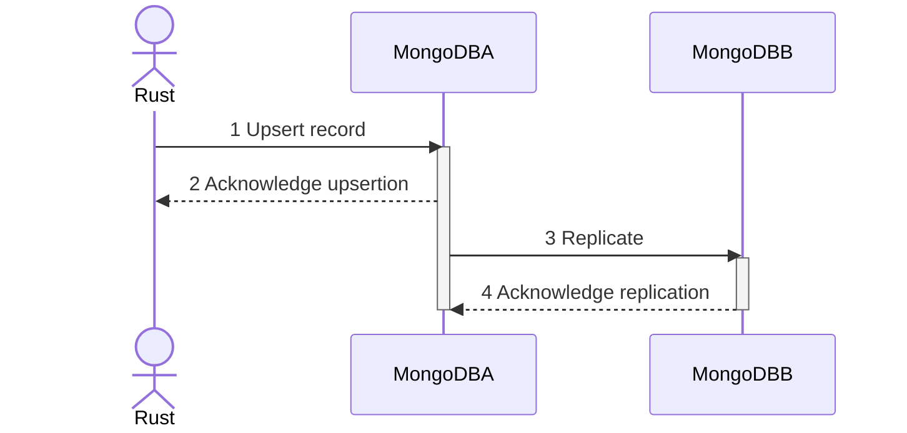

# kubernetes-mongodb
Two MongoDB instances replicating between each other.

```mermaid
sequenceDiagram

%% Download mermaid diagram extension to view the sequence below.
%% Try it on https://mermaid-js.github.io/mermaid-live-editor/edit

actor Rust
participant MongoDBA
participant MongoDBB

Rust->>MongoDBA: 1 Upsert record
activate MongoDBA
MongoDBA-->>Rust: 2 Acknowledge upsertion
MongoDBA->>MongoDBB: 3 Replicate
activate MongoDBB
MongoDBB-->>MongoDBA: 4 Acknowledge replication
deactivate MongoDBB
deactivate MongoDBA
```
